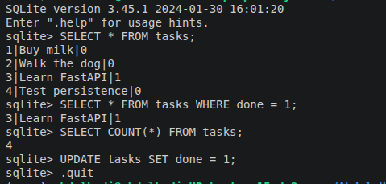

# Task API

A simple CRUD (Create, Read, Update, Delete) API for managing a to-do list, built with **Python** and **FastAPI**.

This project was completed as part of my **Backend AI Engineer internship at FlyRank**.

- **Week 2 (A1):** Built the initial CRUD API with in-memory storage.
- **Week 3 (A2):** Migrated storage to a SQLite database — same endpoints, now persistent.

## Tech stack

- **Language:** Python 3.12
- **Framework:** FastAPI
- **Server:** Uvicorn
- **Database:** SQLite (`tasks.db`)
- **Docs:** Swagger UI (built in at `/docs`)

## How to install and run

```bash
git clone https://github.com/Developer-AHM/flyrank-w2-crud-api.git
cd flyrank-w2-crud-api
python3 -m venv venv
source venv/bin/activate
pip install -r requirements.txt
uvicorn main:app --reload
```

The server starts at `http://localhost:8000`. The database file `tasks.db` is created automatically on first run, along with 3 example tasks — no manual setup needed.

Interactive API docs (Swagger UI): `http://localhost:8000/docs`

## Why SQLite

SQLite was chosen because it's a single file with zero setup — no separate database server to install or run. This made it a natural next step from in-memory storage: the data now survives a server restart, but the project stays just as simple to run as before. A stranger cloning this repo gets a working, seeded database automatically, with one command.

The database file (`tasks.db`) is **not** committed to GitHub — it's listed in `.gitignore`, so every fresh clone starts with a clean, freshly-seeded database rather than inheriting old test data.

## Endpoints

| Method | Path            | Description                          | Success | Error |
|--------|-----------------|---------------------------------------|---------|-------|
| GET    | `/`             | API info (name, version, endpoints)   | 200     | —     |
| GET    | `/health`       | Health check                          | 200     | —     |
| GET    | `/tasks`        | List all tasks                        | 200     | —     |
| GET    | `/tasks/{id}`   | Get a single task by id               | 200     | 404 if not found |
| POST   | `/tasks`        | Create a new task                     | 201     | 400 if title is missing/empty |
| PUT    | `/tasks/{id}`   | Update a task's title and/or done     | 200     | 404 if not found, 400 if title invalid |
| DELETE | `/tasks/{id}`   | Delete a task                         | 204     | 404 if not found |

### Example task object

```json
{
  "id": 1,
  "title": "Buy milk",
  "done": false
}
```

## Example request (curl)

```bash
curl -i -X POST http://localhost:8000/tasks -H "Content-Type: application/json" -d '{"title":"Buy milk"}'
```

Response:

```
HTTP/1.1 201 Created
content-type: application/json

{"id":4,"title":"Buy milk","done":false}
```

## Persistence proof

Unlike Week 2's in-memory version, tasks created now survive a server restart, because they're saved to `tasks.db` on disk instead of a Python variable.

```bash
# create a task, restart the server, then:
curl -i http://localhost:8000/tasks
# the task is still there
```

## Exploring the database directly

You can query `tasks.db` directly, outside the API, using SQLite's command-line tool:

```bash
sqlite3 tasks.db
```

Example query run during development:

```sql
UPDATE tasks SET done = 1;
```

This marked every task as completed. Calling `GET /tasks` through the API immediately afterward reflected the change, with no server restart and no code change — proof that the API and this tool read the exact same file, live.

Terminal screenshot of this session:



## Swagger UI

Every endpoint is documented and testable interactively at `/docs`.


## Project structure

```
task-api/
├── main.py             # All API code
├── requirements.txt    # Python dependencies
├── .gitignore           # Excludes venv/, tasks.db, and cache files
├── Swagger UI.png       # Swagger UI screenshot
├── sqlite-terminal.png  # SQLite CLI exploration screenshot
└── README.md
```